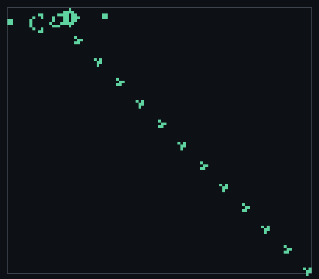
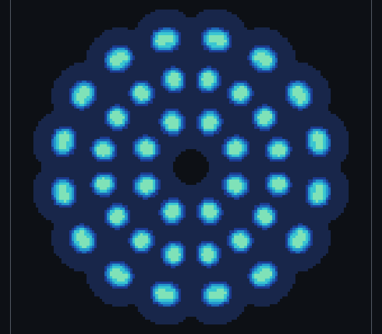
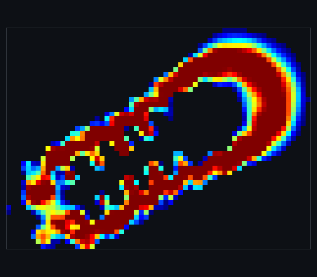

<p align="center">
  
</p>

<h1 align="center">cellar</h1>

<p align="center">
  A fast, unbounded cellular-automata editor and visualizer.<br>
  <a href="https://briar.systems/projects/cellar">Project page</a> ·
  <a href="https://github.com/octalide/cellar/releases">Download</a> ·
  <a href="doc/guide.md">Guide</a>
</p>


| Life | Gray-Scott | Lenia |
|:---:|:---:|:---:|
|  |  |  |

cellar steps an unbounded world on the GPU with compute shaders, falls back to
every CPU core where it must, and switches to HashLife for patterns that need
billions of generations. It is written in [Mach](https://github.com/briar-systems/mach)
on the [boom](https://github.com/briar-systems/boom) engine.

## Features

- **Unbounded world.** A sparse pool of 64 by 64 chunks grows in any direction,
  stepped and drawn on the GPU without a round trip to the CPU.
- **HashLife.** Gosper's algorithm takes a Gosper gun to generation 2^30 in a
  moment.
- **Many rule families.**
  - Life-like and Larger-than-Life rules with weighted kernels up to radius 16
    (`B3/S23`, `R5,C0,M1,S34..58,B34..45,NM`)
  - Generations (`B2/S/C3`, Brian's Brain)
  - isotropic non-totalistic and MAP rules (`B2-a/S12`)
  - Golly `.rule` tables and trees (WireWorld, Langton's Loops)
  - Lenia (`R=13,T=10,b=[1],m=0.15,s=0.015`, Orbium)
  - Gray-Scott reaction-diffusion (`F=0.029,k=0.057`)
  - bounded tori, planes, Klein bottles and cross-surfaces (`B3/S23:T100,100`)
- **Editing.** Draw, erase, stamp, select, walls and bounds, with undo and
  redo across every change.
- **A pattern library** of about three hundred classic Life patterns, Lenia
  creatures and reaction-diffusion seeds.
- **Golly-compatible files.** RLE, plaintext, Life 1.05 and 1.06 and Macrocell,
  plus RLW, cellar's format for exact continuous values. Copy and paste RLE
  straight to and from LifeWiki or Golly.
- **Headless runs and benchmarks** from the command line.

## Install

Release archives for linux (x86-64 and arm64), windows (x86-64) and macOS
(x86-64 and Apple silicon) are on the
[releases page](https://github.com/octalide/cellar/releases).

cellar needs a Vulkan 1.2 GPU with buffer device addresses. On macOS that is
MoltenVK. If it runs slowly, see
[troubleshooting](doc/guide.md#troubleshooting).

## Usage

```
cellar                       # open the editor
cellar pattern.rle           # open a world, pattern or .rule file
cellar run gun.rle --gens 1000 --out gun.mc    # run headless
cellar --bench gpu dense     # measure an engine
```

Press `H` or `F1` in the app for the key reference. `Space` plays and pauses,
`S` steps, `R` randomizes, scroll zooms and the right mouse button pans.

Settings, saved worlds and screenshots live in `~/.local/share/cellar` on
linux, `~/Library/Application Support/cellar` on macOS and `%APPDATA%\cellar`
on windows.

The [guide](doc/guide.md) covers every rule family, the controls, file
formats, headless runs and the bench in full.

## Build

Requires [Mach](https://github.com/briar-systems/mach) 6.10.1 or newer and a C
compiler for GLFW, which mach-glfw builds from source (on linux, the X11 and
Wayland development headers and `wayland-scanner`).

```
git clone https://github.com/octalide/cellar
cd cellar
mach dep pull .   # realize the pinned std, boom, image and their dependencies
mach build .
mach run .
mach test .
```

On macOS, pass `--pie` to `mach build` and `mach run`.

## License

MIT, see [LICENSE](LICENSE).
