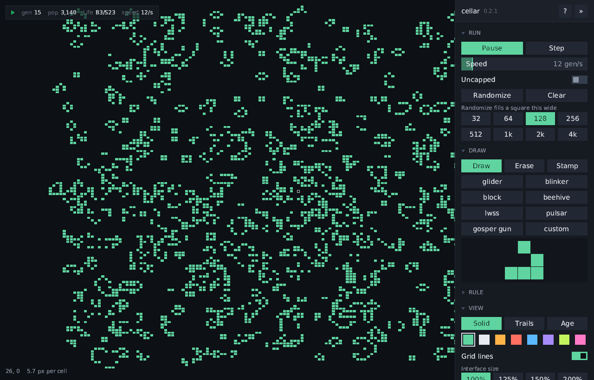

# cellar

An interactive cellular-automata editor and visualizer written in
[Mach](https://github.com/briar-systems/mach), built on the
[boom](https://github.com/briar-systems/boom) engine.



The world is unbounded: a sparse pool of 64 by 64 chunks that holds only the
regions with live cells and their neighbours, growing in any direction. It is
stepped on the GPU by compute shaders written in Mach, and drawn straight from
the GPU's buffers, so neither stepping nor drawing crosses to the CPU. Where no
GPU can run the compute shaders, the CPU steps it instead, split across every
core by chunk. boom owns the window, input, Vulkan renderer and frame loop; the
interface is drawn over the cells in the same overlay pass by a small
immediate-mode layer of cellar's own, with text from an embedded TrueType face.

A kernel is a `(2r+1)x(2r+1)` integer-weight footprint plus birth and survive
bitmasks over the saturated weighted neighbor sum, so it generalizes
Larger-than-Life while still expressing the classic Life family exactly.
Built-in kernels: Conway's Life (`B3/S23`), HighLife (`B36/S23`), Seeds
(`B2/S`) and Day & Night (`B3678/S34678`).

## Controls

| input                  | action                                  |
|------------------------|-----------------------------------------|
| `space`                | play / pause                            |
| `S`                    | single step                             |
| `R`                    | randomize                               |
| `C`                    | clear                                   |
| `D`, `E`, `T`          | draw, erase or stamp tool               |
| `Z`, `X`               | rotate the stamp, flip the stamp        |
| left mouse             | use the tool                            |
| right or middle mouse  | drag to pan                             |
| scroll                 | zoom toward the cursor                  |
| arrow keys             | pan                                     |
| `F`                    | frame the randomize area                |
| `M`                    | next colour mode                        |
| `G`                    | grid lines                              |
| `Tab`                  | hide / show the panel                   |
| `H`, `F1`              | key reference                           |
| `F11`                  | toggle borderless fullscreen            |
| `F12`                  | screenshot                              |
| `Esc`                  | close the key reference, or quit        |

A readout of the generation, population, rule and speed sits in the top-left
corner, and the side panel groups every control by task:

- **run**: play, step, speed, uncapped stepping, randomize and clear, and the
  area randomize fills, from 32 to 4096 cells square
- **draw**: the tool, a palette of built-in patterns and a custom one drawn in
  place, with a preview of the selected pattern
- **rule**: presets, the rule in B/S notation, radius, a clickable weight grid,
  and birth and survive toggles over the reachable sums
- **view**: colour mode (a solid colour from a set of swatches, fading trails,
  or colour by age), grid lines, and the interface size from 100 to 200 percent
- **files**: saving and loading the world and the custom pattern, and
  screenshots

Settings and the rule are kept between runs. They, saved worlds and patterns,
and screenshots live in the platform's user data directory:
`$XDG_DATA_HOME/cellar` (or `~/.local/share/cellar`) on linux,
`~/Library/Application Support/cellar` on macOS and `%APPDATA%\cellar` on
windows. The first run brings over anything an older version left in
`arrangements/` in the working directory.

`cellar --capture shot.png` draws a second of frames, saves the last one and
exits, leaving the saved settings alone.

## Install

Release archives for linux (x86-64), windows (x86-64) and macOS (x86-64 and
Apple silicon) are on the
[releases page](https://github.com/octalide/cellar/releases). cellar needs a
Vulkan driver; on macOS that is MoltenVK.

## Build

Requires [Mach](https://github.com/briar-systems/mach) 6.7 or newer and a C
compiler for GLFW, which mach-glfw builds from source (on linux, the X11 and
Wayland development headers and `wayland-scanner`).

```
git clone https://github.com/octalide/cellar
cd cellar
mach dep pull .   # realize the pinned std, boom, image and their dependencies
mach build .
mach run .
mach test .
```

On macOS, pass `--pie` to `mach build` and `mach run`.

## License

MIT, see [LICENSE](LICENSE).
